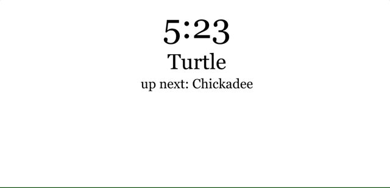

# Presentation-Manager

Simple web app to manage student presentation schedule.

## set up
1. clone repo
2. run `npm install` - requires node
3. run `npm start`
4. open http://localhost:3000/

## routes 

http://localhost:3000/admin/  - control panel

http://localhost:3000/session  - JSON data

